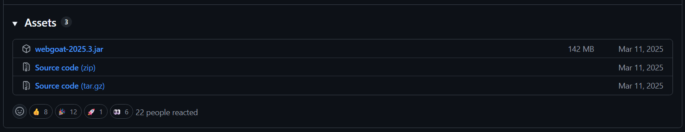

# Practica de auditoria con Juice Shop, WebGoat, SonarQube y OWASP ZAP

Este laboratorio solo levanta los servicios necesarios. El analisis se realiza manualmente
desde SonarQube y OWASP ZAP, siguiendo el enfoque de la actividad practica.
Clona el repositorio oficial de Juice Shop en tu máquina:

git clone https://github.com/juice-shop/juice-shop.git

ir al siguiente link para descargar WebGoat:

https://github.com/WebGoat/WebGoat/releases/tag/v2025.3

Descargar el archivo `Source Code.zip` y extraerlo.



## 1. Levantar servicios

Ejecuta en PowerShell desde la raiz del proyecto:

```powershell
powershell -ExecutionPolicy Bypass -File .\scripts\levantar-servicios.ps1
```

Servicios disponibles:

- Juice Shop: http://localhost:3000
- WebGoat: http://localhost:8082/WebGoat
- WebWolf: http://localhost:9092/WebWolf
- SonarQube: http://localhost:9000
- OWASP ZAP UI: http://localhost:8081/zap
- OWASP ZAP proxy/API: localhost:8090

## 2. Analisis estatico con SonarQube

### Juice Shop

1. Entra a http://localhost:9000.
2. Inicia sesion con el usuario inicial `admin` y clave `admin`.
3. Crea un proyecto para OWASP Juice Shop.
4. Genera un token del proyecto.
5. Ejecuta el analisis con SonarScanner instalado localmente, usando el token generado.

Ejemplo:

```powershell
docker run --rm `
  --network juice-shop-security-lab_security-lab `
  -v "${PWD}/juice-shop:/usr/src" `
  sonarsource/sonar-scanner-cli `
  "-Dsonar.projectKey=JuiceShop" `
  "-Dsonar.sources=/usr/src" `
  "-Dsonar.host.url=http://juice-shop-sonarqube:9000" `
  "-Dsonar.token=TU_TOKEN"
```

El archivo `sonar-project.properties` ya contiene la configuracion base del proyecto.

### WebGoat

Para analisis estatico, SonarQube necesita el codigo fuente. No se modifica nada dentro
de `WebGoat-2025.3`; el script copia el proyecto a una carpeta temporal nueva en
`.sonar-work\webgoat-*` y ejecuta Maven con JDK 23 dentro de Docker. Esa misma base de
codigo incluye WebGoat y WebWolf.

```powershell
powershell -ExecutionPolicy Bypass -File .\scripts\analizar-webgoat-sonarqube.ps1 -SonarToken "TU_TOKEN"
```

Por defecto, el script intenta crear el proyecto `WebGoat2025` en SonarQube usando
`admin/admin` y genera un token temporal de analisis. Si ya cambiaste la clave de admin:

```powershell
powershell -ExecutionPolicy Bypass -File .\scripts\analizar-webgoat-sonarqube.ps1 -SonarAdminPassword "TU_CLAVE_ADMIN"
```

El script envia el token a SonarQube como `sonar.login`, que es el parametro esperado
por SonarQube 9.9 y el scanner Maven usado en este laboratorio. Tambien desactiva SCM
para que la copia temporal no necesite estar dentro de un arbol Git.

## 3. Analisis dinamico con OWASP ZAP

1. Entra a http://localhost:8081/zap.
2. Configura como objetivo una de estas URLs internas si escaneas desde ZAP en Docker:
   - Juice Shop: `http://juice-shop:3000`
   - WebGoat: `http://webgoat:8080/WebGoat`
   - WebWolf: `http://webgoat:9090/WebWolf`
3. Para navegar desde tu navegador local usando ZAP como proxy, configura el proxy en
   `localhost:8090`.
4. Ejecuta spider y active scan desde la interfaz de ZAP.
5. Exporta la evidencia o reporte desde ZAP para anexarlo al reporte tecnico.

Nota: la UI web de ZAP usa WebSwing. Si el navegador muestra "too many active
connections", cierra pestanas antiguas de ZAP y recrea solo ese servicio:

```powershell
docker-compose -f .\docker-compose.security.yml up -d --force-recreate zap
```

## 4. Detener servicios

```powershell
docker-compose -f .\docker-compose.security.yml down
```
